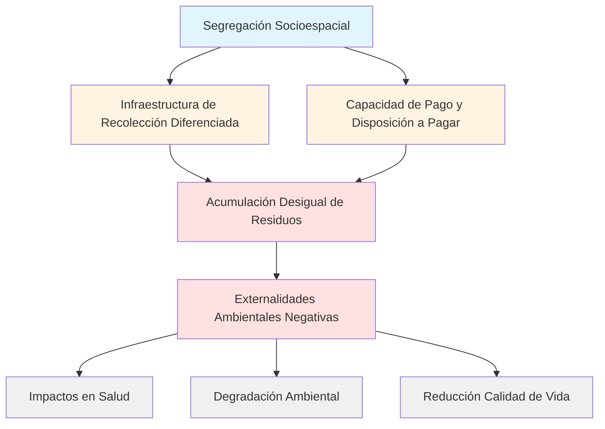

# Estructura de Presentación: Distribución Desigual de Residuos Sólidos en Tijuana

## Diapositiva 1: Portada
- **Título:** Factores que Determinan la Distribución Desigual de Residuos Sólidos Urbanos en Tijuana, Baja California
- **Subtítulo:** Análisis de Variables Socioeconómicas, Geográficas y de Servicio (2025)
- **Autores:** [Nombres del equipo]
- **Fecha:** [Fecha de presentación]
- **Institución:** [Nombre de la institución]

---

## Diapositiva 2: Contexto del Problema
**Título:** ¿Por qué es importante este estudio?

**Contenido:**
- Tijuana genera aproximadamente **2,000 toneladas diarias** de residuos sólidos urbanos (El Imparcial, 2024; Gobierno de Tijuana, 2025)
- Cada habitante genera **1.4 kg de basura al día**, superando el promedio nacional de 1 kg (Uniradio Baja, 2023)
- A nivel nacional, solo el **9.6% de los residuos se reciclan**, lo que indica baja separación en hogares (SEMARNAT, 2024)
- Existen **diferencias visibles** en la acumulación de basura entre colonias
- Impacto en salud pública, medio ambiente y calidad de vida

**Visual:** Foto comparativa de dos colonias (una limpia, otra con acumulación)

**Fuentes:**
- El Imparcial. (2024). General 2 mil toneladas de basura al día Tijuana. https://www.elimparcial.com/tij/tijuana/2024/01/14/general-2-mil-toneladas-de-basura-al-dia-tijuana/
- Gobierno de Tijuana. (2025). Acta de Cabildo XXV Ayuntamiento. https://www.tijuana.gob.mx
- Uniradio Baja. (2023). En Tijuana cada habitante genera 1.4 kilos basura día. https://www.uniradiobaja.com/sociedad/en-tijuana-cada-habitante-genera-14-kilos-basura-dia-promedio-nacional-uno-costa-salvaje-n823565
- SEMARNAT. (2024). La mayor parte de los residuos son reutilizables y reciclables si se separan. https://www.gob.mx/semarnat/articulos/la-mayor-parte-de-los-residuos-son-reutilizables-y-reciclables-si-se-separan

---

## Diapositiva 3: Pregunta de Investigación
**Título:** ¿Qué queremos descubrir?

**Pregunta central:**
*¿Qué factores determinan que algunas zonas del municipio de Tijuana, Baja California, presenten mayor acumulación de residuos sólidos urbanos que otras, considerando variables socioeconómicas, geográficas y de acceso al servicio de recolección durante el año 2025?*

**Delimitación:**
- **Espacial:** Municipio de Tijuana, Baja California
- **Temporal:** Año 2025
- **Temática:** Residuos sólidos urbanos y factores determinantes

---

## Diapositiva 4: Objetivos
**Título:** ¿Qué buscamos lograr?

**Objetivo General:**
Identificar y analizar los factores que determinan la distribución desigual de residuos sólidos urbanos en Tijuana.

**Objetivos Específicos:**
1. Caracterizar la distribución espacial de residuos en diferentes colonias
2. Analizar la relación entre variables socioeconómicas y acumulación de residuos
3. Evaluar la cobertura y calidad del servicio de recolección
4. Identificar factores geográficos que influyen en la acumulación
5. Proponer recomendaciones para mejorar la gestión de residuos

---

## Diapositiva 5: Marco Teórico (Conceptos Clave)
**Título:** Bases Teóricas

**Conceptos principales:**
- **Segregación Socioespacial:** Separación física y social de grupos poblacionales que afecta el acceso a servicios urbanos
- **Infraestructura de Recolección Diferenciada:** Variación en frecuencia, cobertura y calidad del servicio según zona
- **Externalidades Ambientales Negativas:** Costos sociales y de salud derivados de la acumulación de residuos
- **Capacidad de Pago y Disposición a Pagar:** Relación entre nivel socioeconómico y acceso/calidad de servicios

**Visual:** Diagrama conceptual mostrando cómo estos factores se interrelacionan para explicar la acumulación desigual

**Diagrama Mermaid:**

---

## Diapositiva 6: Metodología - Diseño
**Título:** ¿Cómo lo investigamos?

**Tipo de estudio:**
- **Enfoque:** Cuantitativo
- **Diseño:** Correlacional-Descriptivo
- **Alcance temporal:** Transversal (2025)
- **Control:** No experimental

**Instrumento principal:**
- Encuesta estructurada online (Google Forms)
- 14 preguntas cerradas y semicerradas
- Duración: < 10 minutos
- Aplicación: 100% digital

---

## Diapositiva 7: Metodología - Muestra
**Título:** ¿A quiénes encuestamos?

**Universo:**
- Hogares en colonias de Tijuana con diferentes características socioeconómicas y geográficas

**Muestra:**
- **Tamaño:** 200-250 hogares
- **Tipo:** No probabilística por cuotas
- **Distribución:** 8-10 colonias seleccionadas estratégicamente
- **Criterios:** Variedad en nivel socioeconómico, ubicación geográfica y acceso a servicios

**Visual:** Mapa de Tijuana con las colonias seleccionadas marcadas

---

## Diapositiva 8: Hipótesis
**Título:** ¿Qué esperamos encontrar?

**Hipótesis General:**
La distribución desigual de residuos en Tijuana está determinada por la combinación de factores socioeconómicos, geográficos y de acceso al servicio de recolección.

**Hipótesis Específicas (seleccionar 2-3):**
1. Las colonias con menor nivel socioeconómico presentan mayor acumulación de residuos
2. La frecuencia y puntualidad del servicio de recolección influyen directamente en la acumulación
3. Las zonas con dificultades de acceso geográfico tienen menor cobertura del servicio

---

## Diapositiva 9: Instrumento - Encuesta
**Título:** ¿Qué preguntamos?

**Secciones de la encuesta:**

**I. Datos Sociodemográficos (3 preguntas)**
- Colonia de residencia
- Tamaño del hogar
- Nivel de ingreso

**II. Acumulación de Residuos (3 preguntas)**
- Percepción de cantidad de basura
- Comparación con otras colonias
- Causas de acumulación

**III. Servicio de Recolección (5 preguntas)**
- Frecuencia, puntualidad, cobertura, suficiencia, calidad

**IV. Prácticas de Manejo (3 preguntas)**
- Separación de residuos, cantidad generada, participación en programas

---

## SECCIÓN DE RESULTADOS (LLENAR CUANDO TENGAN LOS DATOS)

---

## Diapositiva 10: Perfil de los Encuestados
**Título:** ¿Quiénes respondieron la encuesta?

**RESULTADOS:**

**Participación:**
- Total de encuestas completas: 100
- Colonias representadas: 78 diferentes
- Periodo de recolección: 16-28 noviembre 2025

**Tamaño del hogar:**
- 1-2 personas: 19%
- 3-4 personas: 60%
- 5-6 personas: 18%
- 7 o más: 3%

**Distribución por nivel de ingreso:**
- Menos de $10,000: 16%
- $10,000-$19,999: 37%
- $20,000-$29,999: 19%
- $30,000 o más: 15%
- Prefiero no responder: 13%

**Visual:** Gráfica circular de ingresos + mapa con colonias participantes

---

## Diapositiva 11: Percepción de Acumulación de Basura
**Título:** ¿Cómo perciben los ciudadanos la acumulación de basura?

**RESULTADOS (n=100 encuestados, 78 colonias diferentes):**

**Percepción general:**
- Mucha basura: 17%
- Algo de basura: 54%
- Muy poca basura: 24%
- No hay problema visible: 5%

HALLAZGO: El 71% percibe algún nivel de problema con la basura.

**Comparación entre colonias:**
- 87% considera que hay colonias más limpias que la suya
- 5% dice que no hay diferencia
- 8% dice que todas se ven igual

HALLAZGO CLAVE: Se confirma la desigualdad entre colonias.

**Principales causas identificadas (opción múltiple):**
1. Falta de conciencia ambiental: 73%
2. Falta de contenedores adecuados: 38%
3. Alta densidad poblacional: 26%
4. Falta de servicio de recolección: 24%
5. Dificultad de acceso para el camión: 17%

**Visual:** Gráfica circular para percepción + barras horizontales para causas

---

## Diapositiva 12: Calidad del Servicio de Recolección
**Título:** ¿Cómo evalúan el servicio de recolección?

**RESULTADOS:**

**Frecuencia del servicio:**
- Todos los días: 2%
- 2 a 4 veces por semana: 14%
- 1 vez por semana: 83%
- No pasa nunca: 1%

HALLAZGO: El 83% solo recibe servicio 1 vez por semana.

**Cobertura (¿el camión llega a su vivienda?):**
- Siempre: 82%
- A veces: 13%
- Nunca: 5%

**Puntualidad:**
- Siempre puntual: 28%
- A veces puntual: 65%
- Nunca puntual: 7%

**Suficiencia del servicio:**
- Siempre suficiente: 9%
- La mayoría de veces: 43%
- A veces: 27%
- Casi nunca/Nunca: 13%

HALLAZGO: Solo el 9% considera que el servicio siempre es suficiente.

**Calificación promedio del servicio:** 3.8 de 5

**Visual:** Gráfica de barras apiladas mostrando frecuencia y calidad

---

## Diapositiva 13: Prácticas de Manejo de Residuos
**Título:** ¿Qué hacen los ciudadanos con sus residuos?

**RESULTADOS:**

**Separación de residuos:**
- Sí separan: 20%
- A veces: 19%
- No separan: 61%

HALLAZGO: Solo el 20% separa residuos consistentemente.

**Lugar de disposición:**
- En botes de basura: 90%
- En la calle/piso: 8%
- Otros: 2%

**Generación de residuos por semana:**
- 1-2 bolsas: 21%
- 3-4 bolsas: 44%
- 5-6 bolsas: 17%
- 7 o más bolsas: 10%

**Participación en programas de reciclaje:**
- Sí, regularmente: 4%
- A veces: 22%
- No, nunca: 28%
- No conozco programas: 46%

HALLAZGO CRITICO: El 46% no conoce programas de reciclaje.

**Visual:** Gráfica de columnas agrupadas comparando prácticas

---

## Diapositiva 14: Análisis Comparativo por Colonia
**Título:** ¿Qué diferencias encontramos entre colonias?

**RESULTADOS:**

**Colonias con mayor problemática (reportaron "Mucha basura"):**

| Colonia | Ingreso | Frecuencia | Acceso camión | Causas principales |
|---------|---------|------------|---------------|-------------------|
| Las Torres (parte alta) | Bajo | 1x semana | Nunca llega | Difícil acceso |
| Paseos del Florido | Medio | 1x semana | Nunca llega | Falta conciencia |
| Anexa Buena Vista | Bajo | 1x semana | A veces | Múltiples causas |
| Campos | Medio | 1x semana | Siempre | Nunca puntual |
| Cañada | Bajo | 2-4x semana | Siempre | Alta densidad |
| El Florido | Medio | 1x semana | Siempre | Falta servicio |
| Nueva Tijuana | Medio | 1x semana | A veces | Alta densidad |

**Colonias con menor problemática:**
- Lomas Conjunto Residencial, Verona Residencial, Residencial Agua Caliente (ingreso alto, servicio puntual)

**Patrón identificado:** Las colonias con "mucha basura" comparten:
1. Dificultad de acceso para el camión
2. Baja frecuencia de recolección
3. Ingreso bajo a medio

**Visual:** Mapa de Tijuana con colonias coloreadas (verde-amarillo-rojo)

---

## Diapositiva 15: Correlaciones Encontradas
**Título:** ¿Qué factores están relacionados?

**RESULTADOS - Relaciones significativas encontradas:**

1. **Ingreso vs Percepción de basura**
   - Ingreso bajo (<$10k): 31% reporta "mucha basura"
   - Ingreso alto (>$30k): 13% reporta "mucha basura"
   - CORRELACION: A menor ingreso, mayor acumulación percibida

2. **Frecuencia de recolección vs Percepción**
   - 1x semana: 18% reporta "mucha basura"
   - 2-4x semana: 7% reporta "mucha basura"
   - CORRELACION: Mayor frecuencia = menor acumulación

3. **Acceso del camión vs Percepción**
   - Camión nunca llega: 60% reporta "mucha basura"
   - Camión siempre llega: 15% reporta "mucha basura"
   - CORRELACION MAS FUERTE: El acceso es el factor más determinante

**Factores que predicen mayor acumulación:**
1. Falta de acceso del camión recolector
2. Nivel socioeconómico bajo
3. Baja frecuencia de recolección

**Visual:** Gráfica de barras comparativas mostrando las correlaciones

---

## Diapositiva 16: Conclusiones
**Título:** ¿Qué descubrimos?

**RESULTADOS - Hallazgos principales:**

1. EXISTE DESIGUALDAD CONFIRMADA: El 87% percibe que hay colonias más limpias que la suya.

2. FACTOR SOCIOECONOMICO: Colonias de menor ingreso reportan 2.4 veces más problemas (31% vs 13%).

3. FACTOR DE SERVICIO: El 83% solo recibe recolección 1 vez por semana, insuficiente para el 40%.

4. FACTOR GEOGRAFICO: Donde el camión nunca llega, 60% reporta mucha basura.

5. PARADOJA CULTURAL: 73% culpa a la "falta de conciencia ambiental" pero solo 20% separa residuos.

**Verificación de hipótesis:**
- H1 (Ingreso afecta acumulación): COMPROBADA - 31% vs 13%
- H2 (Frecuencia afecta acumulación): COMPROBADA - 18% vs 7%
- H3 (Acceso afecta acumulación): COMPROBADA - 60% vs 15%
- H4 (Falta de conciencia es factor): COMPROBADA - 73% la señala
- H5 (Baja participación en reciclaje): COMPROBADA - Solo 4% participa

**Hallazgo inesperado:**
- El 46% no conoce programas de reciclaje (problema de difusión institucional)

---

## Diapositiva 17: Recomendaciones
**Título:** ¿Qué proponemos?

**RECOMENDACIONES BASADAS EN RESULTADOS:**

**Para las autoridades municipales:**
1. Aumentar frecuencia de recolección en colonias de alta densidad (actualmente 83% solo 1x/semana)
2. Implementar rutas alternativas para colonias de difícil acceso (17% reporta este problema)
3. Instalar contenedores en puntos estratégicos de colonias marginadas (38% lo pide)
4. Difundir programas de reciclaje (46% no los conoce)

**Para las colonias críticas identificadas:**
- Las Torres (parte alta): Servicio alternativo por difícil acceso
- Paseos del Florido: Aumentar frecuencia de recolección
- Anexa Buena Vista: Contenedores comunitarios
- Nueva Tijuana: Campañas de conciencia ambiental

**Para la comunidad:**
1. Programas de educación ambiental (73% identifica falta de conciencia como causa)
2. Campañas de separación de residuos (solo 20% lo hace actualmente)
2. [Recomendación para ciudadanos]

**Prioridades de acción:**
- Corto plazo: [Acción inmediata]
- Mediano plazo: [Acción a 6 meses]
- Largo plazo: [Acción a 1 año]

---

## FIN DE SECCIÓN DE RESULTADOS

---

## Diapositiva 18: Referencias Principales
**Título:** Bases Bibliográficas

**Fuentes de datos:**
- SEMARNAT (2023). Diagnóstico Básico para la Gestión Integral de Residuos
- INEGI (2020). Censo de Población y Vivienda
- IMPLAN Tijuana (2022). Programa de Gestión Integral de Residuos Sólidos

**Marco teórico:**
- Harvey, D. (2008). The right to the city
- Bullard, R. (1990). Dumping in Dixie: Race, class, and environmental quality
- Wilson et al. (2012). Comparative analysis of solid waste management in cities
- Ajzen, I. (1991). The theory of planned behavior

---

## Diapositiva 19: Agradecimientos y Contacto
**Título:** Gracias por su atención

**Agradecimientos:**
- [Institución educativa]
- [Profesor/a guía]
- Comunidades participantes
- Autoridades municipales colaboradoras

**Contacto:**
- Correo electrónico: [email del equipo]
- Redes sociales: [enlaces]
- Para participar en la encuesta: [link de Google Forms]

**¿Preguntas?**

---

## NOTAS PARA LA PRESENTACIÓN

### Estructura de la presentación:

**OPCIÓN A: Solo propuesta (sin resultados aún)**
Usar diapositivas: 1-9, 18-19
Tiempo: 13 minutos

**OPCIÓN B: Propuesta + Resultados (cuando ya tengan datos)**
Usar diapositivas: 1-19 completas
Tiempo: 25-30 minutos

### Tiempo sugerido por sección:

**Parte 1: Propuesta (Diapositivas 1-9)**
- **Introducción (Diapositivas 1-3):** 3 minutos
- **Objetivos y Marco Teórico (Diapositivas 4-5):** 2 minutos
- **Metodología (Diapositivas 6-9):** 5 minutos

**Parte 2: Resultados (Diapositivas 10-17) - SOLO CUANDO TENGAN DATOS**
- **Perfil y Percepción (Diapositivas 10-11):** 3 minutos
- **Servicio y Prácticas (Diapositivas 12-13):** 3 minutos
- **Análisis Comparativo (Diapositivas 14-15):** 4 minutos
- **Conclusiones y Recomendaciones (Diapositivas 16-17):** 4 minutos

**Cierre (Diapositivas 18-19):** 2 minutos

### Consejos de presentación:
1. **Usa visuales atractivos:** Mapas, gráficos, fotos de colonias
2. **Mantén el texto mínimo:** Usa bullets, no párrafos largos
3. **Practica transiciones:** Conecta cada diapositiva con la siguiente
4. **Prepara ejemplos concretos:** Menciona colonias específicas si es posible
5. **Anticipa preguntas:** Sobre metodología, muestra, análisis

